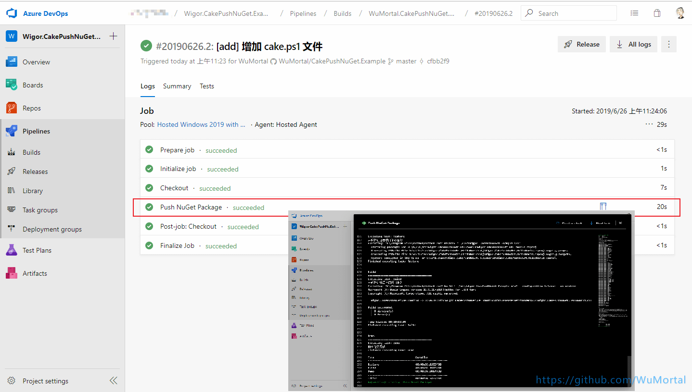
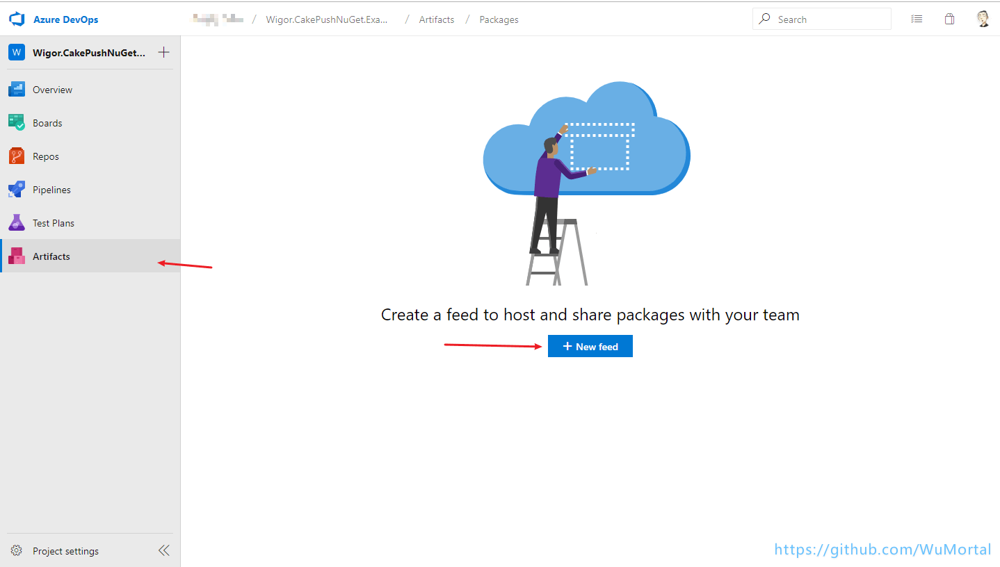
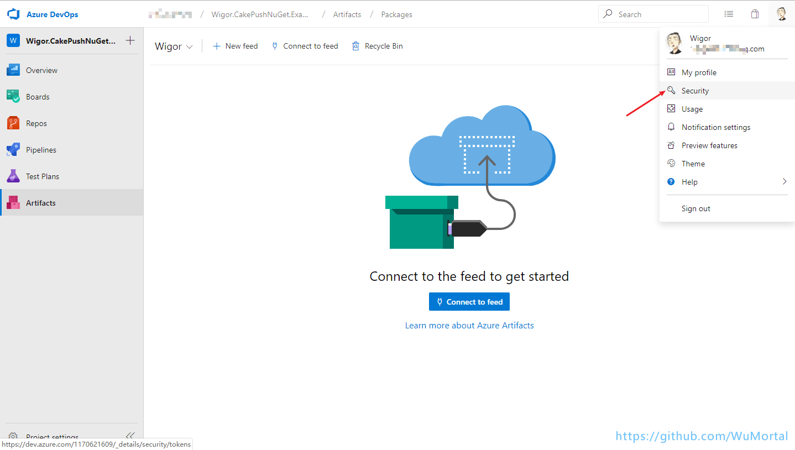
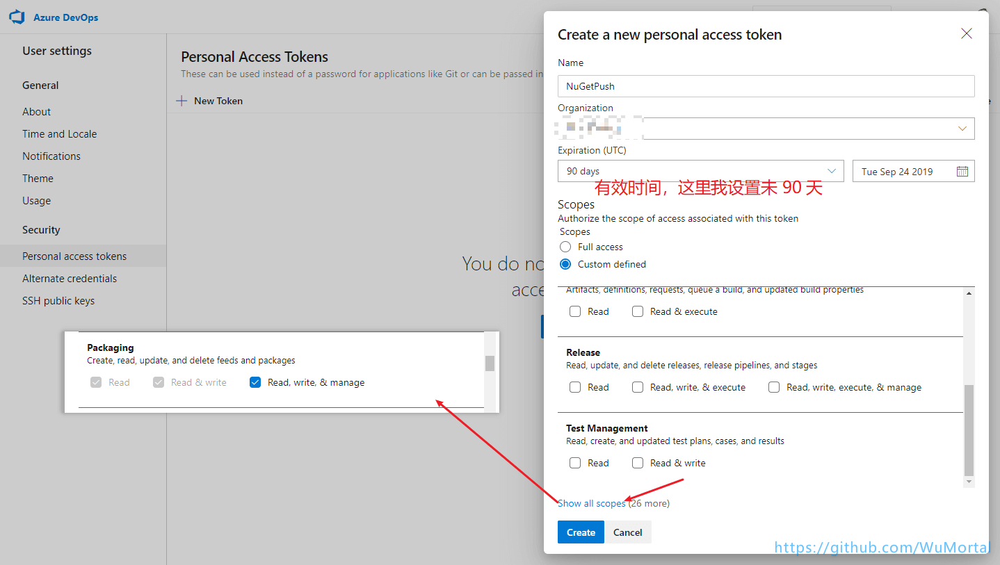
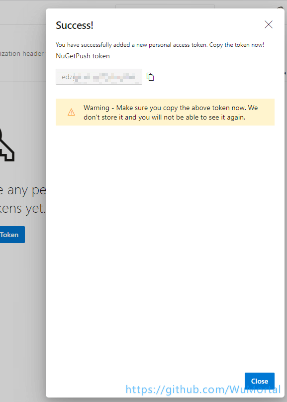

# 前言

[](https://dev.azure.com/1170621609/Wigor.CakePushNuGet.Example/_build/latest?definitionId=1&branchName=master)

大家好，我最近在想如何提交代码的时候自动的打包然后发布到 `AzureDevOps` 中的 `Artifacts`，在这个过程中踩了很多坑，也走了很多弯路，所以这次篇文章就是将我探索的结果和我遇到的一些问题整理分享给大家。 

我的上一篇关于 `CI/CD` 的文章[《使用 Gitlab CI/CD 实现自动化发布站点到 IIS》](https://www.cnblogs.com/AMortal/p/10845783.html) 中是使用脚本的形式实现的，后来有[园友](https://www.cnblogs.com/linianhui/)在下面评论说可以使用 [Cake（C# Make）](https://cakebuild.net/) 这个工具来实现其中的功能，所以本次就不用了脚本了。下面也会将使用 Cake 改造后的实现部署的代码放出。

整体思路：

1. 首先介绍下 `Cake`、`AzureDevops Pipelines/Artifacts` 怎么使用 

2. 接着配置 AzureDevops Pipelines

3. 创建 AzureDevops Artifacts （NuGet 服务端）

4. AzureDevops 配置 PAT (Personal Access Tokens) 和 Pipelines 所需的 Variables（变量）

5. Cake 增加打包、推送 NuGet 包代码。

6. 最后查看运行结果

使用到的工具及版本：

> dotnet core 2.2
>
> cake 0.33.0
>
> PowerShell、NuGet、CredentialProvider
>
> AzureDevops Pipelines 和 AzureDevops Artifacts

# 介绍

- Cake 的全称是 `C# Make`，它是一个跨平台的自动化构建系统，基于 C# DSL，所以可以用我们熟悉的 C# 语言来替换掉我们之前使用脚本的构建方式。使用它我们能非常方便的编译代码，复制文件和文件夹，当然还可以运行单元测试以以确保我们的代码没有问题，我们本次的 NuGet 发布到 Artifacts 它占很重要的地位。

- AzureDevops 的前身是 VSTS，它提供了 Repos、Pipelines、Boards、Test Plans、Artifacts：
    - Repos 提供 Git 存储库，用于代码的源代码控制，你可以直接引入你在 GitHub 上的仓储。
    - Pipelines 提供构建和发布服务，以支持应用程序的持续集成和交付（CI/CD）
    - Boards 提供了一套 Agile 工具，支持使用看板和 Scrum 方法规划和跟踪工作，代码缺陷管理等等，类似的工具有腾讯的 [TAPD](https://www.tapd.cn/)、阿里的 [云效](https://www.aliyun.com/product/yunxiao)、华为云的 [DevCloud](https://www.huaweicloud.com/devcloud/) 等等。
    - Test Plans 提供了多种测试应用程序的工具，包括手动/探索性测试和持续测试
    - Artifacts 允许团队从公共和私人来源共享 Maven，npm 和 NuGet 包。
    协作工具，包括可自定义的团队仪表板和可配置的小部件，以共享信息，进度和趋势; 用于共享信息的内置 wiki; 可配置的通知等。

- CredentialProvider 是凭据提供程序，当我们进行 NuGet Push 时需要进行身份验证，只需要将它放在 NuGet 程序的下即可。

# Cake 安装和使用

本次案例我已经发布到 GitHub 上了：[https://github.com/WuMortal/CakePushNuGet.Example](https://github.com/WuMortal/CakePushNuGet.Example)

安装：这里我使用 dotnet core 进行演示，cake 还支持 .NET Framework、Mono。首先我们需要安装 cake，借助 dotnet tool 这个命令。
``` sh
dotnet tool install --global cake.tool --version 0.33.0
```
安装成功会出现如下提示：


cake 的使用方式非常简单，而且还是 C# 语法相信应该是很容易就能理解的。

这里首先定义了一个 target 变量，它里面保存的就是我们将要执行的 Task（任务）的名称。接着可以看到在在代码块中定义了许多的 Task，这里就是具体需要执行的 “任务”，第一个任务是还原项目的依赖，其实核心代码就一行 `DotNetCoreRestore(solution);`，第二个任务是生成项目，需要说明的是第三个任务其实是将前面两个任务整合到一起。你也可以在中第二个任务 `.IsDependentOn ("Restore") ` 调用第一个任务，当然 `var target = Argument ("target", "Demo");` 就需要改为 `var target = Argument ("target", "Build");` 了，这个看个人喜好了。


``` csharp
var rootPath = "../";   //根目录
var srcPath = rootPath + "src/";    
var solution = srcPath + "Wigor.CakePushNuGet.Example.sln";   //解决方案文件
//需要执行的目标任务
var target = Argument ("target", "Demo");

Task ("Restore")
  .Description ("还原项目依赖")
  .Does (() => {
    //Restore
    Information ("开始执行还原项目依赖任务");
    DotNetCoreRestore (solution);
  });

Task ("Build")
  .Description ("编译项目")
  .Does (() => {
    Information ("开始执行编译生成项目任务");
    //Build
    DotNetCoreBuild (solution, new DotNetCoreBuildSettings {
        NoRestore = true,   //不执行还原，上一步已经还原过了
        Configuration = "Release"
    });
  });

// 执行的任务
Task ("Demo")
  .IsDependentOn ("Restore")    //1. 执行上面的 Restore 任务
  .IsDependentOn ("Build")      //2. 需要执行 上面的 Build 任务
  .Does (() => {
    Information ("所有任务完成");
  });

//运行目标任务 Demo
RunTarget (target);
```

cake 编写好后我们就可以尝试运行它，这里我的 cake 路径是 build/build.cake 大家可以根据具体情况更改 ，命令如下：

``` sh
dotnet cake build/build.cake -verbosity=diagnostic
```


可以看到这里的 cake 已经运行成功了，它会将我们每个任务允许的结果和信息显示在控制台上。


到这里相信大家对 cake 是干什么了有点了解吧，有关它跟多的使用方法可以访问官网：[https://cakebuild.net/](https://cakebuild.net/)

# AzureDevops Pipelines 使用
首先你需要一个 Microsoft 账号或者 GitHub 账号，登录地址为：[https://dev.azure.com](https://dev.azure.com)，登录之后你需要创建一个项目，这里我已经创建好一个项目了，首先我们点击 Pipelines 选择 Builds，之后会出现如下界面，点击 New Pipeline。然后跟着我下面图片的步骤一步一步来就行。


如果你的仓储就在 AzureDevops上那么直接选 Azure Repos Git 就行。


这里如果你的账号是 GitHub 授权登录的话会先跳转到授权界面可能会跳转多次，同意即可。


删除我选中的代码，因为本次我不打算用 AzureDevops Pipelines 的脚本来执行本次操作，它做的只是提供我们 cake 运行的环境。


更换为如下脚本，`PowerShell.exe -file ./cake.ps1` 是指使用 PowerShell 运行我们的 cake.ps1 文件，关于 cake.ps1 文件后面会介绍，这里我们先这样写，接着点击 `Save and run`。


``` yml
trigger:
- master

pool:
  vmImage: 'windows-latest'

steps:
- script: PowerShell.exe -file ./cake.ps1
  displayName: 'Push NuGet Package'
```

可以看到问们管道的运行出现了错误，那是因为我们上面在运行了 cake.ps1 这个脚本，但是我们现在还有创建这个脚本。


回到我们的项目中，将 AzureDevops Pipelines 创建的 `azure-pipelines.yml` 文件 pull 到我们本地。


接着我们编写我们下面缺少的 cake.ps1 文件，它做的事情就是将我们之前手动在 cmd 中运行的命令放入了一个 PowerShell 脚本文件中，你是 Linux 平台的话就编写一个 shell 脚本。


``` sh
# Install cake.tool
dotnet tool install --global cake.tool --version 0.33.0

# 输出将要执行的命命令
Write-Host "dotnet cake build\build.cake -verbosity=diagnostic" -ForegroundColor GREEN

dotnet cake build\build.cake -verbosity=diagnostic
```

尝试项目根目录下运行这个脚本，在 cmd 中执行 `powershell .\cake.ps1`，下面报了一个错。


我们只需要以管理员身份运行 PowerShell 然后执行 `set-ExecutionPolicy RemoteSigned` 即可


然后在次运行 `powershell .\cake.ps1` 或者命令，可以看到正确的输出了


OK，这次我们推送（git push）下代码，在到 AzureDevops Pipelines 看看我们执行结果。


点进去可以看到整个执行的过程，如果报错了也可以从这里看到出错的信息



> 如果是 powershell 报错 AzureDevops Pipelines  是不会显示执行失败的，如果没得到你想要的结果你就需要点开认真的分析你的脚本了。

# AzureDevops Artifacts 使用

前面已经讲过了如果使用 cake 和 在 AzureDevops Pipelines 下执行 cake。下面我们需要创建一个 NuGet Repository，这里我使用 AzureDevops 提供的 Artifacts。




这里面会用的就是 `package source URL` 和下面命令中的 -ApiKey 中的 `AzureDevOps`，还有这里我们需要将 `NuGet + Credentials Provider` 下载到我们的本地，如果你的运行环境是 Linux 或其他可以在 `microsoft/artifacts-credprovider` 的 GitHub 上获取对应平台的这两个包， [点击查看 GitHub 地址](https://github.com/Microsoft/artifacts-credprovider)。

# 创建 PAT (Personal Access Tokens)

上面说过了我们推送 NuGet 包到 Artifacts 时候是需要为两个参数提供指的的 -UserName 和 -Password，这里的 UserName 我们可以随意填，但是 Password 填的的是我们创建的 PAT。




这是选择我们 PAT 所拥有的权限，需要点击 `Show all scopes` 找到 `Packaging` 勾选 `Red,wirte,& manage`。



我们可以看到我们的 PAT ，需要注意的是这个 token 只会出现一次，你需要将它保存好，如果忘记了，那么可以点击 `Regenerate` 重新获取 token。



# AzureDevops Pipelines 添加变量

在 [上一篇文章](https://www.cnblogs.com/AMortal/p/10845783.html) 中我说过了为什么需要变量，这里就不重复了，有兴趣的可以看看。下面开始添加我们需要的变量。


我们需要添加的变量有四个，分别是 `NUGET_REPOSITORY_API_URL`、`NUGET_REPOSITORY_API_KEY`、`USERNAME`、`PASSWORD`。

- NUGET_REPOSITORY_API_URL：就是我们在创建 AzureDevops Artifacts 后出现的 `package source URL`。

- NUGET_REPOSITORY_API_KEY：就是那个 -ApiKey 参数的值 `AzureDevOps`。

- USERNAME：这个上面说过了可以随便填。

- PASSWORD：这个就是之前创建的 PAT。

点击保存（Save & queue）或者 Ctrl + s 保存。


# 添加 NuGet.Tool.cake 和 NuGet.exe、Credentials Provider

这里为已经封装过了的工具类包含了打包和推送方法,地址：[NuGet.Tool.cake](https://github.com/WuMortal/CakePushNuGet.Example/blob/master/build/nuget.tool.cake)

``` csharp
using System;
using System.Collections.Generic;
using System.Linq;
using Cake.Common.Tools.DotNetCore;
using Cake.Common.Tools.DotNetCore.Pack;
using Cake.Common.Tools.NuGet;
using Cake.Common.Tools.NuGet.List;
using Cake.Core;
using NuGet.Packaging;

public class NuGetTool {
    public ICakeContext CakeContext { get; }

    public string RepositoryApiUrl { get; }

    public string RepositoryApiKey { get; }

    public string UserName { get; set; }

    public string Password { get; set; }

    private NuGetListSettings ListSettings => new NuGetListSettings {
        AllVersions = true,
        Source = new string[] { this.RepositoryApiUrl }
    };

    private DotNetCorePackSettings BuildPackSettings (string packOutputDirectory) => new DotNetCorePackSettings {
        Configuration = "Release",
        OutputDirectory = packOutputDirectory,
        IncludeSource = true,
        IncludeSymbols = true,
        NoBuild = false
    };

    private NuGetTool (ICakeContext cakeContext) {
        CakeContext = cakeContext;
        RepositoryApiUrl = cakeContext.Environment.GetEnvironmentVariable ("NUGET_REPOSITORY_API_URL");
        RepositoryApiKey = cakeContext.Environment.GetEnvironmentVariable ("NUGET_REPOSITORY_API_KEY");
        UserName = cakeContext.Environment.GetEnvironmentVariable ("USERNAME");
        Password = cakeContext.Environment.GetEnvironmentVariable ("PASSWORD");
        CakeContext.Information ($"获取所需参数成功：{RepositoryApiUrl}");
    }

    public static NuGetTool FromCakeContext (ICakeContext cakeContext) {
        return new NuGetTool (cakeContext);
    }

    public void Pack (List<string> projectFilePaths, string packOutputDirectory) {
        projectFilePaths.ForEach (_ => CakeContext.DotNetCorePack (_, BuildPackSettings (packOutputDirectory)));
    }

    public void Push (List<string> packageFilePaths) {

        foreach (var packageFilePath in packageFilePaths) {
            CakeContext.NuGetAddSource (
                "wigor",
                this.RepositoryApiUrl,
                new NuGetSourcesSettings {
                    UserName = this.UserName,
                    Password = this.Password
                });

            CakeContext.NuGetPush (packageFilePath, new NuGetPushSettings {
                Source = "wigor",
                ApiKey = this.RepositoryApiKey
            });

        }

    }
}

```

在项目的 build/ 下创建 `nuget.tool.cake` 文件（build/nuget.tool.cake） 拷贝上面的代码。

> 这里参考了最开始提到的园友的项目，非常感谢它的贡献，GitHub 地址如下：[cake.example](https://github.com/linianhui/cake.example)

在创建 `AzureDevops Artifacts` 的时候不是那提供了 `NuGet + Credentials Provider` 的下载地址嘛，现在把它解压到我们项目的 `build\tool\` 下。再次说明这里我是 Windows 环境，如果你的运行环境是 Linux 或其他可以在 `microsoft/artifacts-credprovider` 的 GitHub 上获取对应平台的这两个包， [点击查看 GitHub 地址](https://github.com/Microsoft/artifacts-credprovider)


# 修改 cake.ps1 和 build.cake 文件

修改 cake.ps1，只是增加了 NuGet.exe 的环境变量，应为不加到时候 cake 会找不到 NuGet.exe，或许还有其他办法这里就先这么干，如果各位还有更方便的方法可以在下面留言，感谢！

``` powershell
# 执行的文件
[string]$SCRIPT = 'build/build.cake'

[string]$CAKE_VERSION = '0.33.0'

# 配置 NuGet 环境变量
$NUGET_EXE = "build/tool/NuGet.exe"
$NUGET_DIRECTORY = Get-ChildItem -Path $NUGET_EXE
$NUGET_DIRECTORY_NAME=$NUGET_DIRECTORY.DirectoryName
$ENV:Path += ";$NUGET_DIRECTORY_NAME"

# Install cake.tool
dotnet tool install --global cake.tool --version $CAKE_VERSION

# 参数：显需要执行cake 执行信息
[string]$CAKE_ARGS = "-verbosity=diagnostic"

# 输出将要执行的命命令
Write-Host "dotnet cake $SCRIPT $CAKE_ARGS $ARGS" -ForegroundColor GREEN

dotnet cake $SCRIPT $CAKE_ARGS $ARGS
```

修改 build.cake 文件，看着是多了很多东西其实就多了两个 Task (任务) 分别是： `pack（打包）` 和 `push（推送包）`，这里需要大家需要修改的就是 `solution` 和 `project` 两个变量，将其修改为自己的解决方案名称和需要打包的项目名称。

``` csharp
#reference "NuGet.Packaging"

#load nuget.tool.cake

var target = Argument ("target", "PushPack");

var rootPath = "../";
var srcPath = rootPath + "src/";
var solution = srcPath + "Wigor.CakePushNuGet.Example.sln";
var project = GetFiles (srcPath + "Wigor.CakePushNuGet.HelloWorld/*.csproj");
var nugetPakcageDirectory = $"{srcPath}nugetPackage/";

var nugetTool = NuGetTool.FromCakeContext (Context);

Task ("Restore")
  .Description ("还原项目依赖")
  .Does (() => {
    //Restore
    Information ("开始执行还原项目依赖任务");
    DotNetCoreRestore (solution);
  });

Task ("Build")
  .Description ("编译项目")
  .Does (() => {
    Information ("开始执行编译生成项目任务");
    //Build
    DotNetCoreBuild (solution, new DotNetCoreBuildSettings {
        NoRestore = true,
        Configuration = "Release"
    });
  });

Task ("UnitTest")
  .Description ("单元测试")
  .Does (() => {
    Information ("开始执行单元测试任务");
    
    DotNetCoreTest(solution);
  });

Task ("Pack")
  .Description ("Nuget 打包")
  .Does (() => {
    Information ("开始执行打包任务");

    // 确保目录存在
    EnsureDirectoryExists (nugetPakcageDirectory);

    var packageFilePaths = project.Select (_ => _.FullPath).ToList ();

    nugetTool.Pack (packageFilePaths, nugetPakcageDirectory);
  });

Task ("Push")
  .Description ("Nuget 发布")
  .Does (() => {
    Information ("开始执行 Nuget 包发布任务");
    var packageFilePaths = GetFiles ($"{nugetPakcageDirectory}*.symbols.nupkg").Select (_ => _.FullPath).ToList ();

    nugetTool.Push(packageFilePaths);
  });

Task ("PushPack")
  .Description ("发布 Nuget 包")
  .IsDependentOn ("Restore")
  .IsDependentOn ("Build")
  .IsDependentOn ("Pack")
  .IsDependentOn ("Push")
  .Does (() => {
    Information ("所有任务完成");
  });

RunTarget (target);
```

最后我们推送修改后的代码，查看执行结果看看 NuGet 包是否发布到 `AzureDevops Artifacts` 上。


至此已经实现了 使用 Cake 推送 NuGet 包到 AzureDevops 的 Artifacts 上，你如果不熟悉 `AzureDevops Pipelines` 你也可以用其他的 CI/CD 来执行。

# 补充

在整个尝试过程中肯定会出现一些问题，不要着急认真分析，看看 `AzureDevops Pipelines` 上给出的提示，也可以现在本机跑一下看看是否正常。出现问题第一步查看错误信息，看看有没有错误信息（基本都有），然后根据错误信息去分析是我们的那个地方出错了，顺序是 cake.ps1 --> build.cake --> nuget.tool.cake，然后是所需的 PAT 的权限是否勾选，`AzureDevops Pipelines` 变量是否配置并且是 URL、Key 什么的都是正确，再然后就是 百度、Google。最后你可以在评论区留言（分享你碰到的问题以及解决方法）。

# 相关文献

在这里感谢各位的贡献！

>
> [《[Cake] 0. C#Make自动化构建-简介》](https://www.cnblogs.com/linianhui/p/cake-overview.html)
>
> [《2. dotnet 全局工具 cake》](https://www.cnblogs.com/linianhui/p/cake-with-dotnet-tool.html)
>
> [《基于cake-build的dotnet自动化发布》](https://neilq.github.io/2018/04/18/dotnet-ci-base-on-cake-build/)
>
> [《Pushing Packages From Azure Pipelines To Azure Artifacts Using Cake》](https://daveaglick.com/posts/pushing-packages-from-azure-pipelines-to-azure-artifacts-using-cake)
>
> [AzureDevops Pipelines 变量相关文档](https://docs.microsoft.com/en-us/azure/devops/pipelines/process/variables?view=azure-devops&tabs=yaml%2Cbatch)
>
> [参考项目：CakePushNuGet.Example ](https://github.com/WuMortal/CakePushNuGet.Example)
>
> [参考项目：cake.example ](https://github.com/linianhui/cake.example)
>
